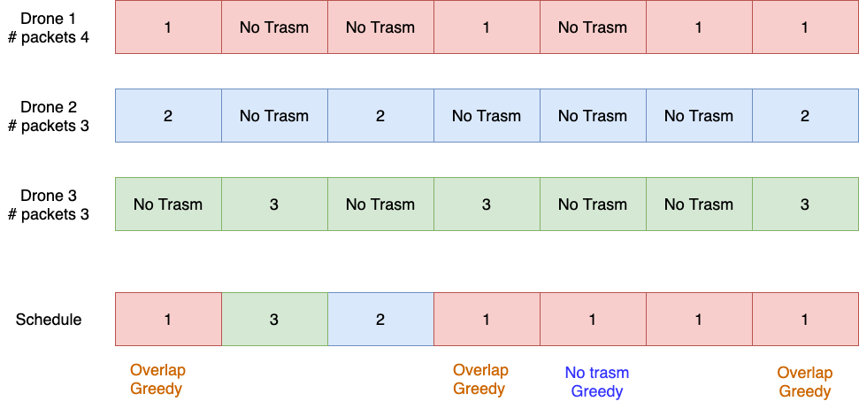
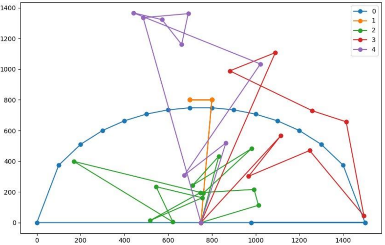

# Autonomous Networking

This repository contains the three project developed for the course Autonomous Networking.
The projects are related on Reinforcement Learning techniques used in a Drone simulator. 
***Grade***: 30 with Laude / 30  
[Page Course](https://twiki.di.uniroma1.it/twiki/view/AN/WebHome). 
[Github Simulator](https://github.com/Andrea94c/DroNETworkSimulator).

# HW1 - Centralized MAC
In the centralized MAC problem there's a centralized entity called depot.
The depot issue to each drone a transmission schedule which is based on slots. 
For futher information read the [report](./hw1%20-%20Centralized%20MAC/Centralized_MAC_report.pdf). 
[Github branch for Centralized MAC](https://github.com/Andrea94c/DroNETworkSimulator/tree/hmw1)

# HW2 - Centralized Patroling Scenario
In this work we address the RL Routing problem, having a single drone (called drone zero) able to sends packets to other drones, called squad drones, which the goal is to send the maximum quantity of packets with minimum delay to the depot. Each drone moves independently from each other following his path, the problem is stationary so the path does not change. 
For futher information read the [report](./hw2%20-%20Centralized%20Patroling%20Scenario/Centralized_Patroling_Scenario_report.pdf). 
[Github branch for Patroling Scenario](https://github.com/Andrea94c/DroNETworkSimulator/tree/hmw2)

# HW3 - Distributed MAC
In this work, we address the MAC protocol problem in a distributed manner, so in contrast to the centralized version, there's no centralized entity (depot) that issues the transmission schedule to each drone in the network. In the distributed version each drone makes autonomous decisions, in which they try to synchronize themselves with other drones in the transmission channel. 
For futher information read the [report](./hw3%20-%20Distributed%20MAC/Distributed_mac_report.pdf). 
[Github branch for Distributed MAC](https://github.com/Andrea94c/DroNETworkSimulator/tree/distributed_mac)
## How use the code
To use the code you have to clone from github the simulator switch to the choosen branch and paste the code in the right folder as specified in the simulator. 
[Github Simulator](https://github.com/Andrea94c/DroNETworkSimulator).

# Authors
* **Andrea Bacciu** - [github](https://github.com/andreabac3)
* **Giuseppe Masi**  - [github](https://github.com/andreabac3)
* **Rocco Pisciuneri**  - [github](https://github.com/andreabac3)
